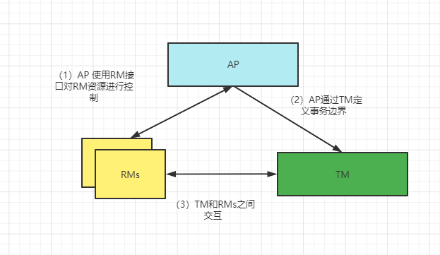

# XA概述

&#8194;&#8194;&#8194;&#8194;XA是由X/Open组织提出的分布式事务规范。XA规范主要定义了全局事务管理器(TM)以及多个
资源管理器(RM)之间的接口规范。
在DTP本地模型实例中，由AP、RMs和TM组成，不需要其他元素。AP、RM和TM之间，彼此都需要进行交互。

- AP(ApplicationProgram): 应用程序，用来定义事务的边界(开始和结束)，并且在边界内对事务进行操作。
- RM(Resource Manager): 资源管理器，用来管理系统资源，是通向事务资源的途径。如数据库，文件系统等，并提供资源访问方式。
- TM(Transaction Manager): 事物管理器，负责分配事务唯一标识，监控事务执行进度，通过RM提供的操作接口负责事务的提交、回滚等。



&#8194;&#8194;&#8194;&#8194;其中XA规范体现在（3),定义了TM和RMs之间的交互规范接口。
XA规范除了定义RM-TM的交互接口外还对两阶段提交协议进行了优化。

## 2pc
两阶段协议(two-phase commit)是在OSI TP标准中提出的，在DTP全局事务模型中指定了全局事务
提交需要使two-phase commit协议；而XA规范只是定义了两阶段提交协议中用到的接口，也就是RM-TM
交互接口，因为两阶段提交参与方只有TM和RMs。

两阶段提交协议从字面意思上理解就是将提交(commit)过程划分为两个阶段。

```html
  In Phase 1, the TM asks all RMs to prepare to commit (or prepare) transaction branches. This asks whether the RM can guarantee 
its ability to commit the transaction branch. An RM may have to query other entities internal to that RM.

  If an RM can commit its work, it records stably the information it needs to do so, then replies affirmatively. A negative reply
reports failure for any reason. After making a negative reply and rolling back its work, the RM can discard any knowledge it has 
of the transaction branch.

  In Phase 2, the TM issues all RMs an actual request to commit or roll back the transaction branch, as the case may be. (Before 
issuing requests to commit, the TM stably records the fact that it decided to commit, as well as a list of all involved RMs.) All
RMs commit or roll back changes to shared resources and then return status to the TM. The TM can then discard its knowledge of 
the global transaction.
```
- phase 1

&#8194;&#8194;&#8194;&#8194;TM通知每个RM准备提交他们的分支事务。如果RM判断自己的工作可以提交,那就对他的工作内容持久化，之后给与TM肯定答复。在回答了
否定信息后并且已经回滚操作，RM就可以丢弃这个分支事务信息。

- phase 2

&#8194;&#8194;&#8194;&#8194;简单来说就是TM向所有RM发出提交或者回滚的事务分支的实际请求。


XA规范对两阶段协议有两点优化：
```text
Protocol Optimisations

• Read-only

  An RM can respond to the TM’s prepare request by asserting that the RM was not asked to update shared resources in this
transaction branch. This response concludes the RM’s involvement in the transaction; the Phase 2 dialogue between the TM 
and this RM does not occur. The TM need not stably record, in its list of participating RMs, an RM that asserts a read-on
ly role in the global transaction.However, if the RM returns the read-only optimisation before all work on the global tra
nsaction is prepared, global serialisability1 cannot be guaranteed. This is because the RM may release transaction contex
t, such as read locks, before all application activity for that global transaction is finished.

2.  One-phase Commit

  A TM can use one-phase commit if it knows that there is only one RM anywhere in the DTP system that is making changes
to shared resources. In this optimisation, the TM makes its Phase 2 commit request without having made a Phase 1 prepar
e request. Since the RM decides the outcome of the transaction branch and forgets about the transaction branch before r
eturning to the TM, there is no need for the TM to record stably these global transactions and, in some failure cases, 
the TM may not know the outcome.
```

<font size=20>只读断言</font>

&#8194;&#8194;&#8194;&#8194;在阶段一中，RM可以断言“我这里不涉及任何共享资源的增删改”来答复TM的prepare请求。从而让当前的分支事务脱离全局事
务的范畴，从而免去了phase 2。这种优化发生在其他RM都完成prepare之前的话，使用了只读断言的RM早于AP其他的动作前就释放了相关数据上的上下文(比如读
锁之类的)，这时候其他全局事务或者本地事务就有机会去改变这些数据，可能造成脏读。

<font size=20>一阶段提交</font>
如果需要增删改查的数据都在一个RM上，TM可以使用一阶段提交---跳过两阶段中的phase 1，直接执行phase 2。


