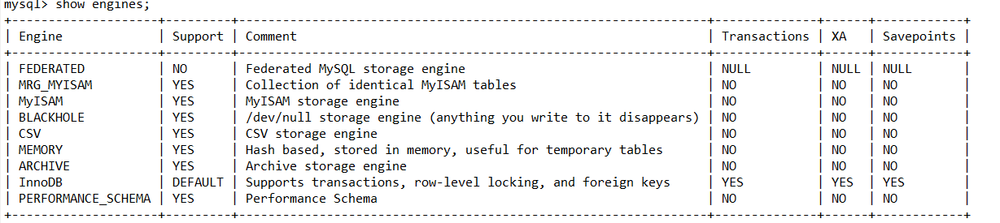

# mysql对XA的支持

mysql从5.0.3开始支持XA分布式事务，且只有Innodb支持。MySQL Connector/J 从5.0.0版本之后开始直接提供对XA的支持。



需要注意的是， 在DTP模型中，mysql属于资源管理器(RM)。而一个完整的分布式事务中，一般会存在多个RM，由事务管理器TM
来统一进行协调。因此，这里所说的mysql对XA分布式事务的支持，一般指的是单台mysql实例如何执行自己的事务分支。

<font size=10>mysql XA事务语法</font>
```text
XA {START|BEGIN} xid [JOIN|RESUME]

XA END xid [SUSPEND [FOR MIGRATE]]

XA PREPARE xid

XA COMMIT xid [ONE PHASE]

XA ROLLBACK xid

XA RECOVER [CONVERT XID]
```
mysql XA事务案例，一个分支事务如何如何将一行记录插入数据库。

```sql
mysql> xa start 'xid';
Query OK, 0 rows affected (0.00 sec)

mysql> insert into t_student_0 values (99,'jack',10);
Query OK, 1 row affected (0.07 sec)

mysql> xa end 'xid';
Query OK, 0 rows affected (0.00 sec)

mysql> xa prepare 'xid';
Query OK, 0 rows affected (0.12 sec)

mysql> xa recover;
+----------+--------------+--------------+------+
| formatID | gtrid_length | bqual_length | data |
+----------+--------------+--------------+------+
|        1 |            3 |            0 | xid  |
+----------+--------------+--------------+------+
1 row in set (0.02 sec)

mysql> xa commit 'xid';
Query OK, 0 rows affected (0.00 sec)
```
<font size=10>Mysql XA事务状态</font>
XA事务的状态，按照如下步骤进行展开

1.使用XA START来启动一个XA事务，并把它置于ACTIVE状态。

2.对于一个ACTIVE状态的 XA事务，我们可以执行构成事务的SQL语句，然后发布一个XA END语句。XA END把事务放入IDLE状态。

3.对于一个IDLE 状态XA事务，可以执行一个XA PREPARE语句或一个XA COMMIT…ONE PHASE语句：

XA PREPARE把事务放入PREPARED状态。在此点上的XA RECOVER语句将在其输出中包括事务的xid值，因为XA RECOVER会列出处于PREPARED状态的所有XA事务。

XA COMMIT…ONE PHASE用于预备和提交事务。xid值将不会被XA RECOVER列出，因为事务终止。

4.对于一个PREPARED状态的 XA事务，您可以发布一个XA COMMIT语句来提交和终止事务，或者发布XA ROLLBACK来回滚并终止事务。 


针对个给定的客户端连接而言，XA事务和非XA事务(即本地事务)是互斥的。例如，已经执行了”XA START”命令来开启一个XA事务，则本地事务不会被启动，直到XA事务已经被提交或被 回滚为止。相反的，如果已经使用START TRANSACTION启动一个本地事务，则XA语句不能被使用，直到该事务被提交或被 回滚为止。

最后，如果一个XA事务处于ACTIVE状态，是不能直接进行提交的，如果这样做，mysql会抛出异常。

<font size=10>Xid

Xid是作为事务分支标识符，在XA规范中被定义。
在Mysql官方文档中关于Xid的组成有如下说明:
```yaml
xid: gtrid [, bqual [, formatID ]]
```
gtrid: 是一个全局事务标识符
bqual: 分支事务标识符
formatId: 是一个数字，用来标记gtrid和bqual的格式。是一个无符号整数，最小为0.不设置的情况下
默认为1。
通过XA recover命令我们可以看到所有处于prepare状态的分支事务信息：
```sql
mysql> xa recover;
+----------+--------------+--------------+------+
| formatID | gtrid_length | bqual_length | data |
+----------+--------------+--------------+------+
|        1 |            2 |            2 | dddd |
+----------+--------------+--------------+------+
```
&#8194;&#8194;&#8194;&#8194;其中data表示xid的值，其实就是gtrid+bqual。不过在xid的结构中显示的是gtrid_length和bqual_length,
表示gtrid和bqual的长度。通过长度信息我们根据data可以反推出gtrid和bqual。

&#8194;&#8194;&#8194;&#8194;gtrid就是data[0]--data[gtrid_length-1]部分的值。

&#8194;&#8194;&#8194;&#8194;bqual就是data[gtrid_length]--data[gtrid_length+bqual_length-1]部分的值。

&#8194;&#8194;&#8194;&#8194;通过这条信息我们可以这个xid就是属于dd全局事务中的dd分支事务。
<font size=10>通过jdbc操作mysql XA事务</font>
```java
        Connection conn1 = DriverManager.getConnection("jdbc:mysql://localhost:3306/ds0", "root", "123456");
        XAConnection xaConn1 = new MysqlXAConnection((com.mysql.jdbc.Connection) conn1, true);
        //获取资源管理器操作实例接口 RM1
        XAResource rm1 = xaConn1.getXAResource();

        Connection conn2 = DriverManager.getConnection("jdbc:mysql://localhost:3306/ds1", "root", "123456");
        XAConnection xaConn2 = new MysqlXAConnection((com.mysql.jdbc.Connection) conn2, true);
        XAResource rm2 = xaConn2.getXAResource();

        // AP请求TM执行一个分布式事务，TM生成全局事务id
        byte[] gtrid = "g12345".getBytes();
        int formatId = 1;
        try{
            //=================分别执行rm1 rm2上的分支事务
            //TM生成rm1上的事务分支id
            byte [] b1 = "b00001".getBytes();
            Xid xid1 = new MysqlXid(gtrid,b1,formatId);
            // 执行rm1上的事务分支
            rm1.start(xid1,XAResource.TMNOFLAGS);
            PreparedStatement preparedStatement = conn1.prepareStatement("insert into t_user_0 values(66,?,?)");
            preparedStatement.setString(1,"kim");
            preparedStatement.setInt(2,3);
            preparedStatement.execute();
            rm1.end(xid1,XAResource.TMSUCCESS);

            //TM生成rm2上的分支事务id
            byte[] b2 = "b00002".getBytes();
            Xid xid2 = new MysqlXid(gtrid,b2,formatId);
            //执行rm2上的事务分支
            rm2.start(xid2,XAResource.TMNOFLAGS);
            PreparedStatement preparedStatement2 = conn2.prepareStatement("insert into t_user_0 values(233,?,?)");
            preparedStatement2.setString(1,"lisa");
            preparedStatement2.setInt(2,2);
            preparedStatement2.execute();
            rm2.end(xid2,XAResource.TMSUCCESS);
            new MysqlXADataSource();
            //=================两阶段提交

            // phase1: 询问所有的rm 准备提交事务分支
            int rm1_pre = rm1.prepare(xid1);
            int rm2_pre = rm2.prepare(xid2);
            // phase2: 提交所有事务分支
            boolean onePhase = false; //TM判断有2个事务分支 所以不能优化为一阶段提交
            if(rm1_pre == XAResource.XA_OK && rm2_pre == XAResource.XA_OK){
                rm1.commit(xid1,onePhase);
                rm2.commit(xid2,onePhase);
            }else {
                rm1.rollback(xid1);
                rm2.rollback(xid2);
            }


        }catch (Exception e){
            e.printStackTrace();
        }finally {
            conn1.close();
            conn2.close();
        }
```
在这里我们以代码的形式体现了一个XA分支事务边界的开启以及操作。
在MysqlXAConnection中实现了XAResource定义的XA操作接口,比如：
```java
 public void start(Xid xid, int flags) throws XAException {
        StringBuilder commandBuf = new StringBuilder(MAX_COMMAND_LENGTH);
        commandBuf.append("XA START ");
        appendXid(commandBuf, xid);

        switch (flags) {
            case TMJOIN:
                commandBuf.append(" JOIN");
                break;
            case TMRESUME:
                commandBuf.append(" RESUME");
                break;
            case TMNOFLAGS:
                // no-op
                break;
            default:
                throw new XAException(XAException.XAER_INVAL);
        }

        dispatchCommand(commandBuf.toString());

        this.underlyingConnection.setInGlobalTx(true);
    }
```
这个就是向mysqlServer端发送 XA START XID的命令。
