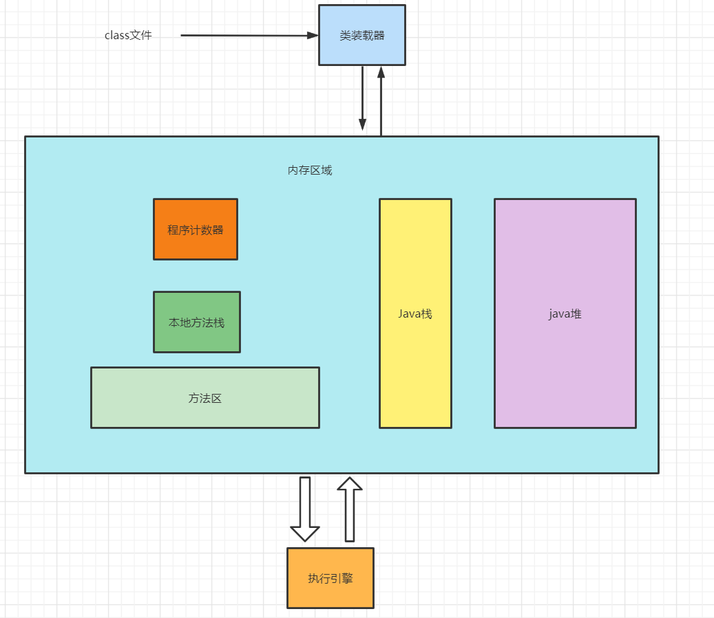
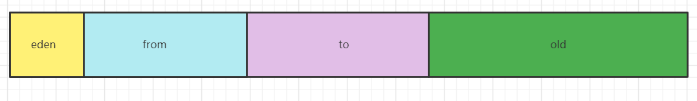

# jvm 内存模型

- Java堆
java堆存储的都是对象，所有对象实例和数组都要在堆上分配，这块区域被所有线程共享。
java堆主要分为年轻代和老年代，年轻代又分为eden区和survivor区，survivor分为两块比例大小相同的区域。

新生代 : 
##### eden区
java新生对象的出生地(如果新生的对象比较大则直接分配至老年代)，当eden区内存不够的时候就会触发MinorGC，对新生代进行垃圾回收
##### survivor区
survivorFrom区:保留上一次eden区垃圾回收的幸存者
survivorTo区: 
- 虚拟机栈

- 程序计数器

- 本地方法栈

- 方法区